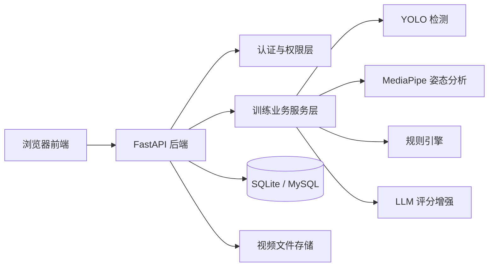
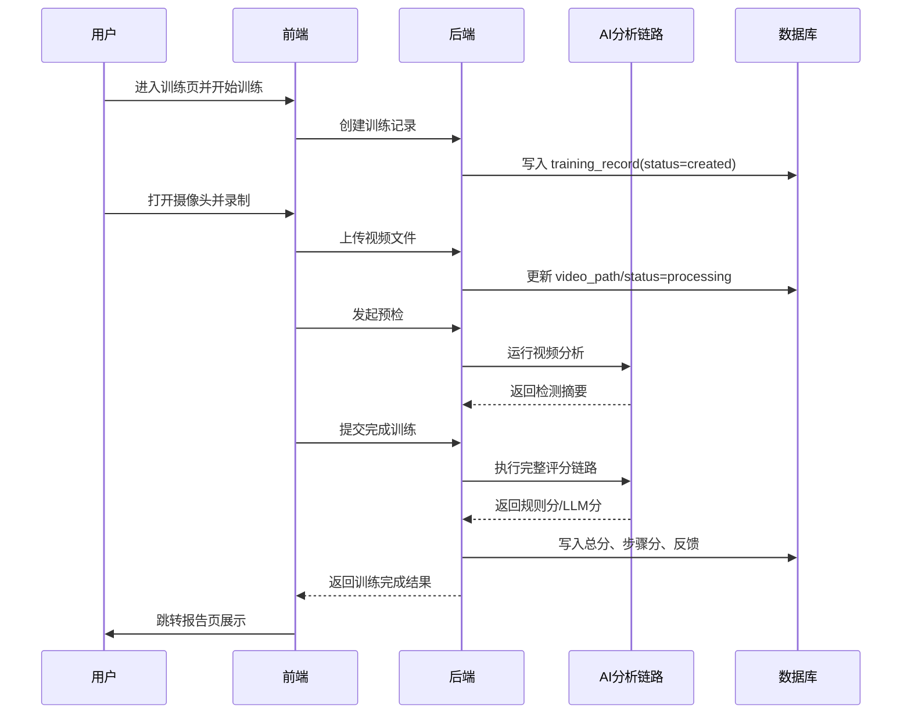
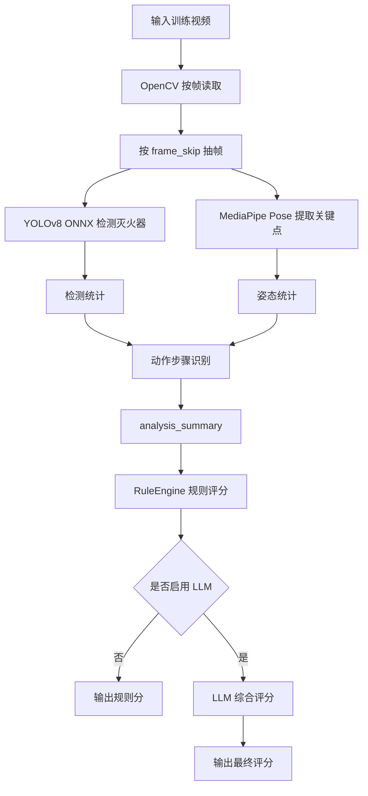

# FireTrain 系统设计详解

## 1. 文档目标

本文档面向项目负责人、开发人员、答辩评审与后续维护人员，系统性说明 FireTrain 灭火器实操测评系统的整体设计思路与当前落地实现。文档重点覆盖以下内容：

- 系统整体架构与模块划分
- 前端与后端的职责边界
- 三层权限与三类角色的设计
- 核心业务流程与关键页面
- MediaPipe、YOLO 与 LLM 联合评分链路
- 数据存储、部署方式与后续扩展方向

需要特别说明的是：本文档以当前仓库中的实际实现为基础编写，既描述业务目标，也尽量对齐当前代码结构与接口行为。

---

## 2. 系统定位

FireTrain 是一个面向消防灭火器实操训练与测评场景的智能训练平台。系统以“视频采集 + 动作识别 + 姿态分析 + 规则评分 + 大模型增强解释”为核心路线，为学员、管理员和系统最高管理者提供统一的训练、管理、分析和复盘能力。

系统不是单纯的视频上传平台，也不是单纯的图像识别系统，而是一个围绕“训练闭环”构建的业务系统。它的核心目标包括：

1. 支持用户在线完成灭火器标准操作训练。
2. 对训练视频进行自动化分析与评分。
3. 将评分结果沉淀为训练记录、统计图表与训练报告。
4. 支持管理员代上传视频、查看用户训练、追踪系统运行效果。
5. 通过规则引擎和 LLM 结合，提升评分的稳定性、可解释性与可读性。

---

## 3. 总体架构设计

### 3.1 架构概览

从架构形态上看，FireTrain 目前采用“前后端分离 + 单体后端服务 + 本地模型推理”的设计：

- 前端：基于 Vue 3 + Vite + Element Plus，负责页面呈现、交互编排、视频录制、结果展示。
- 后端：基于 FastAPI + SQLAlchemy，负责认证鉴权、业务编排、训练流程管理、视频分析调度、评分结果持久化。
- AI 分析层：以后端内嵌服务形式运行，使用 YOLOv8 ONNX 做器材检测，使用 MediaPipe Pose 做人体姿态分析，使用规则引擎和 LLM 完成评分。
- 数据层：当前默认使用 SQLite，适合开发与演示；整体模型设计已经考虑迁移到 MySQL 等关系型数据库。
- 文件层：训练视频与管理员上传视频按目录落盘保存，数据库中保存路径、状态与评分摘要。

### 3.2 逻辑架构图

### 3.3 分层思想

系统整体贯彻了比较清晰的分层思想：

- 表现层：前端页面、管理后台、统计图表、训练报告。
- 接口层：后端 API 路由，负责参数校验、权限接入、返回统一响应。
- 业务层：Service 层负责编排训练流程、调度 AI 分析、处理评分回退。
- 数据层：Repository 层负责数据库读写，隔离 ORM 细节。
- 模型分析层：`backend/app/ai` 目录中的检测、姿态、规则、LLM 模块。

这样的好处是：页面变更不会直接影响评分引擎，数据库变化也不会直接冲击路由逻辑，便于后续维护与迭代。

---

## 4. 技术栈设计

### 4.1 前端技术栈

前端采用现代 Web 单页应用方案，核心技术如下：

- `Vue 3`：页面组件化开发
- `Vite`：开发服务器与构建工具
- `Vue Router`：路由管理
- `Pinia`：用户状态、角色视图状态管理
- `Element Plus`：管理后台与业务页面 UI 组件
- `Axios`：前后端通信
- `ECharts`：训练趋势、维度分析、雷达图展示
- 浏览器原生媒体能力：`getUserMedia`、`MediaRecorder` 实现录制与上传

### 4.2 后端技术栈

后端采用 Python 生态的轻量高效方案：

- `FastAPI`：REST API 服务
- `Uvicorn`：ASGI 运行服务
- `SQLAlchemy Async`：异步 ORM 与数据库访问
- `Pydantic`：请求响应数据校验
- `python-jose`：JWT 认证
- `passlib/bcrypt`：密码哈希
- `httpx`：调用外部 LLM 接口

### 4.3 AI 技术栈

AI 侧的设计不是单模型覆盖全部任务，而是按任务类型拆分：

- `YOLOv8 ONNX Runtime`：检测灭火器等目标是否稳定出现在画面中
- `MediaPipe Pose`：提取人体关键点、计算姿态角度、形成姿态质量特征
- `RuleEngine`：基于步骤、证据和时序进行可控评分
- `LLMScoringService`：在规则分基础上生成更自然、更综合的最终评分结果

这种组合方案兼顾了工程可控性与智能化表现：

- 纯规则容易僵硬，但稳定；
- 纯 LLM 可读性强，但容易漂移；
- YOLO + MediaPipe 提供结构化证据，规则引擎提供基线，LLM 在此基础上做增强，整体更平衡。

---

## 5. 代码结构设计

### 5.1 前端结构

前端核心目录位于 `frontend/src`，主要划分如下：

- `router/`：全局路由与守卫
- `store/`：用户状态、角色切换状态
- `api/`：接口请求封装
- `views/`：用户端页面
- `views/admin/`：后台管理页面
- `components/`：公共组件，如导航栏
- `utils/`：训练类型、报告解析等工具函数
- `styles/`：主题样式

这一结构体现出“页面组织按业务域分组，接口组织按资源分组”的思路，既便于新功能扩展，也方便多人协作。

### 5.2 后端结构

后端核心目录位于 `backend/app`，主要划分如下：

- `api/`：HTTP 路由层
- `services/`：业务服务层
- `repositories/`：数据库访问层
- `models/`：ORM 数据模型
- `schemas/`：接口入参出参模型
- `ai/`：视觉分析、规则评分、LLM 评分
- `core/`：配置、安全、基础设施
- `middleware/`：权限控制等中间逻辑
- `db/`：数据库基类、会话、引擎

其中最关键的设计是 `api -> service -> repository` 的调用链，能够保证控制器不直接拼业务，仓储层不侵入接口语义。

---

## 6. 前端系统设计

### 6.1 前端目标

前端不仅承担页面展示，更承担训练过程中的实时交互组织。它要完成的任务包括：

- 登录注册与身份入口控制
- 用户训练开始、录制、暂停、上传、提交
- 训练历史查询与报告查看
- 个人统计图表展示
- 管理后台的用户管理、训练管理、管理员上传视频检测
- 管理端与用户端之间的视图切换

### 6.2 页面体系

系统前端大体分为两大门户：

1. 用户训练门户
2. 管理后台门户

用户门户主要包含：

- 首页
- 登录/注册
- 训练页
- 历史记录页
- 统计页
- 个人中心
- 训练报告页

后台门户主要包含：

- 后台仪表盘
- 用户管理
- 用户详情/新建用户
- 训练数据管理
- 管理员视频上传分析
- 操作日志
- 管理员管理（仅 root）
- 后台报告页

### 6.3 路由与守卫设计

系统路由集中定义在 `frontend/src/router/index.js`。其核心设计点有三个：

1. 通过 `meta.requiresAuth` 控制是否需要登录。
2. 通过 `meta.requiresRole` 控制访问角色，如 `/admin` 限制为 `admin` 和 `root`。
3. 路由守卫优先读取前端维护的 `effectiveRole`，从而支持不改数据库字段的前端视图切换体验。

这意味着：系统不是简单地“登录后放行”，而是把登录态与角色态都纳入了路由阶段控制。

### 6.4 训练页面设计

训练页是整个系统最核心的交互页面之一，主要完成以下任务：

- 选择训练类型
- 展示标准步骤说明
- 打开摄像头
- 调用浏览器能力录制视频
- 管理录制状态：开始、暂停、继续、完成、取消
- 显示上传进度、上传速度和提示信息
- 在提交前发起预检
- 跳转到报告页进行结果查看

训练页面的设计特点如下：

- 强引导：页面内直接展示 6 个标准步骤，降低用户误操作概率。
- 强反馈：通过状态标签、步骤进度、上传进度条告诉用户当前处于哪个阶段。
- 强安全：训练前就提醒“全身入镜、避免遮挡、动作连续清晰”。
- 强闭环：训练结束后自动进入上传、预检、AI 评分、报告查看链路。

### 6.5 统计与报告页面设计

统计页与报告页承担“训练结果可视化”和“训练复盘”的作用。

统计页的主要功能：

- 展示个人训练次数、平均分、趋势变化
- 用图表展示步骤分析与维度对比
- 帮助用户形成长期训练认知，而不是只看单次分数

报告页的主要功能：

- 展示总分、等级、步骤分
- 展示动作完整性、姿态规范性、时效性三个维度
- 用雷达图强化可理解性
- 展示系统自动生成的总体反馈与改进建议

这两类页面共同构成了“训练后价值交付层”，它们决定了系统不是只会打分，而是能辅助教学与复训。

### 6.6 后台管理设计

后台管理端不是简单的 CRUD 页面，而是业务管控中心，核心承担：

- 用户账户管理
- 训练记录管理
- 系统使用概览
- 日志追踪
- 代上传视频分析
- Root 专属的管理员账户管理

后台与前台共用同一套服务，但通过角色和路由隔离出管理能力。这种设计能减少系统重复开发成本。

### 6.7 身份切换设计

系统还实现了一个很有特色的能力：管理员可切换到用户模式体验前台流程。

其设计价值在于：

- 方便管理员从用户视角验证训练流程
- 便于演示和测试
- 降低“管理员账号无法复现普通用户问题”的排查成本

当前实现中，前端通过 `Pinia + localStorage(view_role)` 维护视图角色，后端同时提供 `switch-role` 接口支持与数据库角色状态联动。

---

## 7. 后端系统设计

### 7.1 后端职责

后端的核心职责不只是提供接口，而是扮演整个平台的业务中枢：

- 负责用户认证与角色权限控制
- 管理训练记录生命周期
- 保存与管理视频文件路径
- 调度 AI 视频分析
- 聚合检测结果并生成评分
- 将评分结果写入数据库
- 支撑统计分析与后台管理

### 7.2 路由层设计

后端 API 根据业务域拆分为多个模块：

- `users.py`：登录、注册、用户信息、角色切换等
- `training.py`：训练开始、上传、预检、完成、历史、详情等
- `statistics.py`：个人统计与趋势分析
- `admin.py`：后台用户管理、管理员管理、日志与总览数据
- `admin_videos.py`：管理员代上传视频分析

这种设计的优点是：接口域清晰，便于权限隔离，也便于后续单独拆分后台模块。

### 7.3 Service 业务编排层设计

系统中的复杂业务都尽量收敛到 Service 层，尤其是训练业务：

- `TrainingService.start_training`：创建训练记录
- `TrainingService.upload_video`：将记录状态切换为处理中并绑定视频路径
- `TrainingService.complete_training_with_ai_analysis`：完成整套 AI 分析与评分流程

这个设计非常关键，因为训练完成不是单个接口动作，而是一条长链路：

1. 校验训练状态
2. 加载模型
3. 执行视频分析
4. 进行有效性校验
5. 先规则评分
6. 按配置决定是否进行 LLM 增强评分
7. 将结果写入数据库
8. 更新任务进度

如果把这条链路直接写在路由里，接口层会非常臃肿；使用 Service 后，结构明显更清晰。

### 7.4 Repository 数据访问层设计

Repository 层的存在，是为了把“数据库操作”与“业务语义”拆开。

例如训练相关的读写都集中在 `training_repository.py` 中，这样有几个好处：

- 路由和服务不需要关心 SQLAlchemy 细节
- 后续如果换数据库或改索引，改动更集中
- 更容易补测试

### 7.5 配置与基础设施设计

后端使用统一的配置对象管理关键参数，包括：

- 数据库连接地址
- 视频目录
- 管理员视频目录
- YOLO 模型路径
- LLM API Key、Base URL、Model 名称

这意味着系统从一开始就不是把模型路径或密钥硬编码在业务逻辑里，而是考虑了部署切换与环境隔离。

---

## 8. 三层权限与三类角色设计

系统的权限设计可以从两个维度理解：

1. 角色维度：`student`、`admin`、`root`
2. 控制维度：认证层、角色授权层、资源归属层

这两个维度叠加后，形成了比较完整的权限体系。

### 8.1 三类角色划分

#### 1. 学员角色 `student`

学员是系统的基础使用者，主要能力包括：

- 登录系统
- 发起训练
- 上传自己的训练视频
- 查看自己的训练历史
- 查看自己的训练报告
- 查看个人统计结果

学员不能访问后台管理路由，也不能查看其他用户的训练记录。

#### 2. 管理员角色 `admin`

管理员是业务管理层角色，主要能力包括：

- 进入后台管理
- 查看系统总览
- 管理普通用户
- 查看训练记录
- 上传指定用户的视频并触发 AI 分析
- 查看部分后台日志与统计

管理员不能执行 Root 专属的高危操作，例如创建 Root、管理 Root 级别账号等。

#### 3. 超级管理员 `root`

Root 是最高权限角色，除拥有管理员能力外，还具备：

- 管理管理员账号
- 创建新管理员
- 删除管理员
- 调整管理员相关权限边界

Root 角色代表系统级最高控制权限，是整个平台权限链的顶层。

### 8.2 第一层：认证层

认证层的目标是确认“你是谁”。

当前系统采用 JWT 认证：

- 用户登录成功后签发 Access Token
- Token 中携带 `user_id` 和 `role`
- 后续请求通过 `Bearer Token` 携带身份信息

系统还设计了登出黑名单逻辑，用于在单进程场景下让 token 立即失效。这是一个实用但偏轻量的实现，适合当前阶段。

### 8.3 第二层：角色授权层

角色授权层的目标是确认“你有没有资格访问某类接口”。

系统通过 `require_role(*allowed_roles)` 装饰器进行控制。例如：

- 管理后台接口通常要求 `admin` 或 `root`
- 管理员管理接口要求 `root`

这种设计的优点是：

- 语义清晰
- 易于复用
- 权限边界直接附着在接口定义上，便于审查

### 8.4 第三层：资源归属层

资源归属层的目标是确认“这条数据是不是你的”。

以训练记录为例，即使用户已经通过了登录认证，也不意味着可以操作任意训练记录。系统会继续校验：

- `training.user_id` 是否等于当前登录用户

如果不一致，则拒绝访问或修改。

这层设计非常关键，因为真实系统中最常见的问题不是“没登录”，而是“拿着合法账号访问不属于自己的资源”。资源归属校验就是防止这种越权。

### 8.5 权限设计总结

可以用一句话概括当前权限模型：

> 先用 JWT 证明身份，再用角色判定功能范围，最后用资源归属限定数据边界。

这是一个适合教学训练平台的、结构清晰且工程代价适中的权限方案。

---

## 9. 核心业务流程设计

### 9.1 用户训练主流程

用户端一次完整训练大致分为以下阶段：

### 9.2 管理员代上传流程

管理员可为指定用户上传视频并触发后台分析。这一流程的业务价值在于：

- 支持教师/管理员统一采集线下训练视频后集中上传
- 支持补录与复核
- 支持示范视频的统一分析

该流程与普通用户训练共用核心评分服务，因此避免了“双套评分逻辑”导致的偏差。

### 9.3 历史与统计流程

系统在训练完成后并不是只保存一个分数，而是保存多维度评分摘要，并在此基础上支持：

- 个人历史记录查询
- 单次训练报告复盘
- 趋势图分析
- 步骤维度对比
- 后台训练总览

这使得系统具备从“单次评分工具”提升为“持续训练平台”的基础。

---

## 10. AI 评测系统设计

这一部分是 FireTrain 的核心竞争力，也是整个系统最值得重点说明的内容。

### 10.1 设计目标

灭火器实操训练的视频分析并不适合只靠一种技术完成。因为它同时涉及：

- 目标是否出现
- 人是否在画面中
- 姿态是否规范
- 步骤是否完整
- 时序是否合理
- 证据不足时是否仍能给出相对公允的评分

因此系统采用“检测 + 姿态 + 规则 + LLM”的组合方案。

### 10.2 AI 流水线总览

### 10.3 视频分析入口

视频分析的核心入口是 `TrainingInferenceService.analyze_video`。这一服务负责：

- 打开视频
- 获取帧率、总帧数、时长
- 按策略抽帧
- 对每一帧执行目标检测与姿态分析
- 聚合结果为 `frame_results`
- 从帧级结果中总结步骤序列、时长、检测统计、姿态统计
- 输出统一结构 `analysis_summary`

也就是说，这个服务的职责不是直接打分，而是先把视频转换成“可计算、可解释、可存档”的结构化摘要。

#### 10.3.1 视频读取与抽帧策略

系统使用 OpenCV 的 `cv2.VideoCapture` 对视频逐帧读取，先获取：

- `fps`：视频帧率
- `total_frames`：总帧数
- `duration`：视频总时长

随后根据视频长度进行自适应抽帧：

- 当视频总帧数小于 300 帧时，`frame_skip = 1`，即逐帧分析；
- 当视频总帧数大于等于 300 帧时，`frame_skip = 2`，即每隔 1 帧分析 1 帧。

这一策略本质上是在“分析精度”和“处理效率”之间做平衡：

- 短视频本身帧数少，逐帧处理可以保留更多动作细节；
- 长视频如果逐帧全量分析，计算开销会明显上升，因此采用隔帧采样降低耗时。

对于每一个被抽中的分析帧，系统都会记录：

- `frame_idx`：原始帧索引
- `timestamp`：当前帧在视频中的时间位置
- `detections`：YOLO 目标检测结果
- `pose_result`：MediaPipe 姿态结果
- `frame_features`：基于检测与姿态进一步加工得到的帧级语义特征

因此，FireTrain 实际上不是简单“抽几帧给模型看”，而是把被抽中的每一帧都组织成统一的数据单元，后续所有步骤识别、统计聚合和评分都以这个单元为基础。

#### 10.3.2 帧级处理总流程

每个分析帧的处理顺序如下：

1. 读取 BGR 帧图像。
2. 输入 YOLO 检测器，识别灭火器目标。
3. 输入 MediaPipe Pose，提取人体关键点与姿态角度。
4. 基于检测结果与姿态结果，构造 `frame_features`。
5. 将该帧的原始结果和加工结果写入 `frame_results`。

这一步非常关键，因为系统从一开始就把“原始视觉结果”和“业务语义特征”分开保存：

- 原始结果用于追踪模型输出；
- 语义特征用于步骤识别和评分。

这种分层设计能让后续调参与错误分析更容易进行。

### 10.4 YOLO 检测模块设计

YOLO 模块由 `FireExtinguisherDetector` 实现，当前采用 ONNX Runtime 进行推理。

#### 设计原因

选择 YOLO 的主要原因是：

- 对目标检测任务成熟稳定
- 对器材类对象检测效果较好
- ONNX Runtime 部署轻量，CPU 环境也能运行
- 相比直接依赖 PyTorch 推理，更适合演示和工程落地

#### 在系统中的职责

YOLO 在 FireTrain 中不是负责“全流程判断”的，而是负责提供一个非常关键的基础证据：

- 灭火器是否出现在视频中
- 出现了多少帧
- 置信度如何
- 边界框和中心点如何变化

这些信息会被进一步汇总为：

- `frame_count`
- `detection_count`
- `average_confidence`
- 灭火器在步骤中的出现占比

#### 10.4.1 YOLO 输入输出数据

YOLO 模块的输入是单帧 BGR 图像，系统在推理前会完成以下预处理：

- BGR 转 RGB
- 缩放到模型输入尺寸 `640 x 640`
- 像素值归一化到 `[0, 1]`
- 变换为 `CHW` 格式
- 增加 batch 维度

模型输出后，系统会进行后处理：

- 将输出张量转置为检测候选格式
- 取每个候选框的最大类别分数
- 使用置信度阈值过滤低质量候选
- 将中心点框坐标转换为原图坐标
- 通过 NMS 去除高度重叠的重复框

最终每个检测结果会被组织为结构化字典，核心字段包括：

- `class_id`
- `class_name`
- `confidence`
- `bbox`
- `center`
- `area`

也就是说，YOLO 在系统中不仅判断“有没有灭火器”，还提供了器材的空间位置信息、置信度信息和面积信息，这些都是后续做步骤判断的重要基础。

#### 10.4.2 检测结果的统计加工

系统不会直接把所有检测框原样送入评分模块，而是先做聚合统计，生成 `detection_stats`。聚合后的核心指标包括：

- `detection_count`：总检测次数
- `frame_count`：至少检测到一次该类别的帧数
- `max_confidence`：该类别最高置信度
- `average_confidence`：平均检测置信度

这些统计结果在数据层面的意义是：

- `frame_count` 反映器材在视频中的稳定可见程度；
- `average_confidence` 反映检测可信度；
- `detection_count` 反映目标出现的总体强度。

与只使用“是否检测到”相比，这种聚合结果更适合用于评分和 LLM 解释。

#### 为什么它很重要

在训练场景中，如果视频里连灭火器都没有稳定识别到，那么再高级的后续评分都缺乏基础。YOLO 在整个系统中扮演的是“器材证据入口”的角色。

### 10.5 MediaPipe 姿态分析设计

MediaPipe 模块由 `PoseAnalyzer` 实现，主要用于提取人体关键点与姿态角度。

#### 选择 MediaPipe 的原因

- 对人体关键点检测成熟
- 使用方便，适合实时或准实时视频分析
- 在 CPU 环境下也较容易部署
- 对教学类动作评估有良好的结构化表达能力

#### 在系统中的职责

MediaPipe 负责输出人体姿态相关证据，包括：

- 关键点坐标
- 各关键点可见度
- 手臂角度
- 身体直立角度
- 姿态评分结果

#### 10.5.1 MediaPipe 提取了哪些数据

MediaPipe Pose 输出的核心不是单一类别标签，而是人体关键点序列。系统当前重点使用以下几类关键点：

- 鼻尖
- 左右肩
- 左右肘
- 左右手腕
- 左右髋
- 左右膝
- 左右踝

在此基础上，系统进一步计算了：

- `right_arm`：右臂角度
- `left_arm`：左臂角度
- `body`：身体直立角度

然后再按照预设标准角度范围给出姿态评分结果，每个角度评分包含：

- 实际角度值
- 标准范围
- 偏差值
- 分数
- 等级
- 反馈文本

因此，MediaPipe 的输出不是简单的“有人/无人”，而是形成了可量化的姿态证据。

#### 10.5.2 姿态数据的加工方式

系统对姿态数据做了两类处理：

第一类是单帧处理，即针对当前帧计算：

- 是否成功提取到关键点
- 左右臂角度
- 身体角度
- 各角度对应的姿态分

第二类是全视频聚合，即对全部姿态帧形成 `pose_stats_summary`，主要统计：

- `mean`
- `min`
- `max`
- `count`
- `stability`

其中 `stability` 定义为角度的最大值减最小值，用于描述动作稳定性。这个设计很适合实操训练场景，因为灭火器操作并不只关心“做到了”，也关心“做得稳不稳”。

系统重点关注的不是“人体存在”本身，而是“人体动作是否符合标准操作规律”。例如：

- 身体是否基本保持稳定
- 手臂抬起角度是否合理
- 肘部弯曲是否在合理范围
- 瞄准动作是否有明确姿态信号

#### 在评分中的意义

MediaPipe 输出的姿态结果会成为两个层面的重要依据：

1. 作为“视频中确实有人在操作”的证据
2. 作为“动作规范性”维度评分的重要基础

因此，MediaPipe 实际承担的是“从有无动作，提升到动作质量”的任务。

### 10.6 YOLO 与 MediaPipe 的协同关系

FireTrain 的 AI 设计不是让 YOLO 与 MediaPipe 互相替代，而是让它们互补：

- YOLO 解决“器材是否在场”
- MediaPipe 解决“人体动作是否成立”
- 两者结合后，才能判断“操作者是否围绕灭火器完成了规范操作”

如果只有 YOLO，系统会知道灭火器出现了，但不知道动作是否规范。
如果只有 MediaPipe，系统会知道有人在动，但不知道是否真的进行了灭火器操作。

两者结合后，才能形成更可信的训练证据链。

#### 10.6.1 帧级语义特征构造

为了让步骤识别不直接依赖底层模型原始输出，系统在每个分析帧上又构造了一层 `frame_features`。这部分可以理解为“视觉结果到业务语义之间的中间表示”。

当前主要构造了以下帧级特征：

- `extinguisher_detected`：当前帧是否检测到灭火器
- `extinguisher_count`：灭火器检测框数量
- `extinguisher_confidence`：当前帧灭火器最大置信度
- `pose_available`：当前帧是否有有效姿态
- `right_arm`、`left_arm`、`body`：关键角度
- `stable_body`：身体是否处于稳定站姿
- `arm_bent`：手臂是否处于弯曲状态
- `arm_extended`：手臂是否处于伸展状态
- `arm_asymmetry`：双臂动作非对称程度
- `both_arms_visible`：双臂是否同时可见
- `nozzle_control_posture`：是否形成握喷管姿态
- `aiming_posture`：是否形成瞄准姿态
- `pose_quality`：基于姿态评分结果聚合得到的姿态质量分
- `detected_actions`：将当前帧可识别动作语义写成标签列表

这一步是系统非常重要的工程设计，因为它完成了从“低层视觉信号”到“高层动作语义”的过渡。

#### 10.6.2 这里做了哪些数据层面的加工

从数据处理角度看，系统至少做了以下几层转换：

1. 原始视频帧 -> 抽样分析帧
2. 分析帧 -> YOLO 检测结果 + MediaPipe 姿态结果
3. 模型结果 -> 帧级语义特征 `frame_features`
4. 连续帧特征 -> 步骤片段 `step_sequence`
5. 步骤片段与全视频统计 -> `analysis_summary`
6. `analysis_summary` -> 规则评分 / LLM 输入摘要

这种分层转换非常适合毕业论文表述，因为它说明系统不是端到端黑箱，而是有明确中间状态和数据加工链路的可解释型架构。

### 10.7 步骤识别与摘要生成设计

检测与姿态分析只是中间环节，真正服务评分的是总结后的结构化摘要。

系统会基于帧级特征进一步生成：

- `step_sequence`：识别到的步骤序列
- `step_times`：各步骤时长
- `step_feature_summary`：步骤完成情况、动作证据、问题点
- `detection_stats`：器材检测统计
- `pose_stats_summary`：姿态统计
- `missing_steps`：未识别到的步骤
- `validity_checks`：是否具备评分条件

这个设计非常重要，因为它把“CV 输出”转换成了“业务可读的训练语义”。后面的规则引擎和 LLM，都是围绕这个统一摘要来工作的。

#### 10.7.1 步骤识别的核心思路

系统没有直接采用“某一帧属于某一步骤”的刚性分类方式，而是使用“宽松顺序 + 证据累积”的状态机进行步骤识别。这样设计的原因是：

- 灭火器训练动作是连续过程，不适合按单帧硬切；
- 教学视频和实拍视频容易出现遮挡、停顿、讲解插入等情况；
- 如果完全依赖单帧分类，步骤切换会非常不稳定。

因此，当前状态机做了几项重要改进：

- 允许前向跳跃最多 2 步，而不是只能严格逐步前进；
- 使用 9 帧滑动窗口累计证据，而不是只看单帧结果；
- 使用视频相对进度而不是固定时间阈值判断早期、中期、后期步骤；
- 只要证据累计超过阈值才形成步骤片段，减少噪声触发。

#### 10.7.2 各步骤是如何打候选分的

系统为 6 个标准步骤都定义了候选分计算逻辑，核心用到的证据包括：

- 灭火器是否出现
- 姿态是否可用
- 身体是否稳定
- 手臂是否弯曲
- 手臂是否伸展
- 双臂是否非对称
- 双臂是否同时可见
- 是否形成握喷管姿态
- 是否形成瞄准姿态
- 近期灭火器连续可见比例
- 近期手臂运动幅度
- 当前帧在整段视频中的相对时间位置

例如：

- 准备阶段更依赖姿态和站稳；
- 提灭火器更依赖灭火器出现和手臂弯曲；
- 拔保险销更依赖双臂非对称；
- 握喷管更依赖双臂可见和握持姿态；
- 瞄准火源更依赖手臂伸展与瞄准姿态；
- 压把手更依赖连续手臂运动和后期阶段特征。

也就是说，系统不是靠单一规则判一步，而是把多个证据融合成步骤候选分。

#### 10.7.3 最终识别了哪些结构化数据

在视频分析完成后，系统会形成两类关键数据：

第一类是步骤序列级数据：

- 步骤名称
- 开始时间
- 结束时间
- 持续时长
- 证据置信度
- 峰值置信度
- 灭火器出现比例
- 平均姿态质量
- 检测到的动作标签
- 对应标准关键点说明

第二类是全视频级摘要数据：

- 视频时长
- 总帧数
- 已处理帧数
- 检测到的目标类别
- 灭火器是否出现
- 人体姿态是否出现
- 完成步骤数
- 已完成步骤
- 缺失步骤
- 检测统计
- 姿态统计
- 步骤级特征汇总
- 有效性校验结果

对于毕业论文来说，这一节可以作为“数据层与特征层设计”的重点内容，因为它体现了系统如何把原始视频逐层压缩为业务语义摘要。

#### 10.7.4 这里的创新性改动

与传统的硬阈值步骤识别相比，FireTrain 在这里做了几项更适合真实训练场景的改动：

1. 将固定绝对时间阈值改为视频相对进度，增强了对不同视频长度的适应能力。
2. 将单帧判定改为滑动窗口证据累积，提升了对抖动和偶发误检的鲁棒性。
3. 允许有限步长前向跳跃，降低教学视频、示范视频中的漏检率。
4. 将底层视觉结果进一步加工为帧级语义动作标签，使状态机不再直接依赖生硬的模型原始输出。

这几项改动虽然不属于全新算法发明，但在工程层面显著增强了系统对真实训练视频的适配性，这也是毕业设计中非常值得强调的“场景化创新”。

### 10.8 有效性校验设计

系统在评分前还会执行一层有效性校验，典型规则包括：

- 视频中没有人体姿态且没有灭火器证据时，不进入正常评分
- 视频时长小于一定阈值时，认为无法形成有效评估

这一层的目标不是苛刻拦截，而是避免“完全无证据的视频”进入正常评分流程，导致结果失真。

值得注意的是，当前实现已经不再要求“必须识别出全部步骤才可评分”，而是改为：

- 只要存在足够姿态或器材证据，就允许进入评分
- 评分高低由后续规则引擎与 LLM 根据证据强度决定

这是一个更符合真实教学场景的设计，因为实际拍摄中经常会出现镜头不稳、遮挡、分段保守等情况。

### 10.9 规则引擎设计

规则引擎是评分体系的基线层，其意义在于“可控、稳定、可解释”。

它主要根据以下信息计算基线分：

- 步骤是否完成
- 步骤权重
- 姿态质量
- 动作完整性
- 时效性

最终输出内容包括：

- `total_score`
- `performance_level`
- `dimension_scores`
- `step_scores`
- `feedback`

在工程设计上，规则引擎承担“兜底”和“基线”两项任务：

- 当 LLM 不可用时，系统仍然能够独立评分
- 即使启用了 LLM，也必须先产出规则基线，以便让最终评分具备更高稳定性

#### 10.9.1 规则引擎到底处理了哪些数据

规则引擎的输入不是原始视频，也不是单帧检测框，而是前面生成的 `analysis_summary`。其主要读取的数据包括：

- `step_feature_summary`
- `pose_stats_summary`
- `video_duration`
- 训练类型对应的标准时长范围

然后完成以下计算：

- 基于步骤完成度、姿态质量、器材出现比例和步骤时长计算 `step_scores`
- 基于步骤权重计算动作完整性分
- 基于姿态质量和身体稳定度计算姿态规范性分
- 基于总时长与标准时长区间计算时效性分
- 按 `0.4 + 0.4 + 0.2` 权重生成综合总分

从数据层面看，规则引擎的价值在于把“多源结构化证据”稳定映射为“评分结果”，相当于完成一次标准化判分。

### 10.10 LLM 评分增强设计

LLM 模块由 `LLMScoringService` 实现，采用 OpenAI 兼容接口调用外部模型。

#### 设计理念

系统没有让 LLM 直接读原始视频，而是让它读取经过压缩整理的结构化摘要。这种设计有几个核心优点：

- 降低 token 成本
- 提高调用稳定性
- 避免模型胡乱想象视频细节
- 让 LLM 更像“评分教官”而不是“视觉模型”

#### 输入内容

LLM 会收到以下信息：

- 视频基础摘要
- 检测统计
- 姿态统计
- 步骤级证据
- 规则引擎基线分
- 特殊情况下的“证据强度提示”

#### 10.10.1 送给 LLM 的不是原始视频，而是结构化数据包

系统传给 LLM 的内容，本质上是从 `analysis_summary` 和规则评分结果中提炼出的结构化文本数据，而不是视频帧本身。这些数据主要包括六个层次：

1. 基础摘要  
包括视频时长、处理帧数、姿态帧数、灭火器是否出现、已完成步骤数、缺失步骤列表。

2. 检测统计  
包括灭火器等类别的 `frame_count`、`detection_count`、`average_confidence`。

3. 姿态统计  
包括 `right_arm`、`left_arm`、`body` 等角度的均值、最小值、最大值和稳定性。

4. 步骤级证据  
包括每个步骤的 `completed`、`confidence`、`duration`、`pose_quality_score`、`extinguisher_presence_ratio`、`detected_actions`、`issues`。

5. 规则基线分  
包括总分、表现等级、三大维度分数、各步骤分。

6. 证据强度提示  
当系统发现“步骤识别较少，但器材和姿态证据很强”时，会显式告诉 LLM 不要机械打低分。

换句话说，系统在调用 LLM 之前，已经完成了一轮“数据压缩、证据筛选和语义重组”，LLM 看到的是一个高度结构化的证据包。

#### 10.10.2 LLM 在这里具体做了什么

LLM 在 FireTrain 中并不是负责底层识别，而是负责以下更高层任务：

- 综合解释规则分是否合理
- 在弱证据场景下进行更柔性的综合判断
- 输出更自然的步骤反馈文本
- 输出更完整的总体评价
- 给出更符合训练语境的改进建议

因此，LLM 更像“智能评语生成与综合评分器”，而不是“视觉检测器”。

#### 特别设计：弱证据推断

系统在 prompt 中明确告诉 LLM：

- 如果状态机只识别出很少步骤，但器材与姿态证据充足，不要机械地打 0 分
- 应结合帧级证据进行公允推断

这个设计非常关键，因为它体现了 FireTrain 在评分策略上的一个重要思想：

> 不追求机械僵硬的“识别多少步就给多少分”，而追求“基于证据做合理推断”的训练评估。

#### 10.10.3 这里做了哪些创新改动

这一部分是系统相对有特色的地方，主要体现在以下几点：

1. 没有把 LLM 直接用于原始视频理解，而是用于结构化证据综合判断，显著降低了不确定性。
2. 引入“规则引擎基线分 + LLM 增强”的双层评分架构，既保证稳定性，又提升了反馈自然度。
3. 对弱证据场景加入显式提示机制，避免 LLM 简单按步骤缺失机械扣分。
4. 对 LLM 输出做严格 JSON 约束、字段校验和失败回退，提升了工程可用性。

如果从毕业论文角度总结，这里的创新重点不是“训练了一个新的大模型”，而是“设计了一套面向技能训练评估场景的结构化证据驱动式 LLM 评分机制”。

#### 输出内容

LLM 输出严格 JSON，包括：

- 总分
- 表现等级
- 三大维度分数
- 六个步骤的分数与反馈
- 总评
- 改进建议

#### 回退策略

如果 LLM 调用失败、超时、格式异常，系统会自动回退到规则评分结果。

这说明 LLM 在整个架构中是“增强层”，不是“唯一依赖层”，这是一种更稳健的工程设计。

### 10.11 AI 评分链路总结

FireTrain 的 AI 评分链路可以概括为：

> 用 YOLO 解决器材证据，用 MediaPipe 解决动作证据，用规则引擎保证评分下限，用 LLM 提升评分表达与综合判断能力。

这一设计兼顾了准确性、稳定性、可解释性和展示效果，是系统最核心的智能化部分。

#### 10.11.1 从数据流角度总结整条链路

如果从数据层面总结，整个视频评测链路可以概括为：

`原始视频 -> 抽帧图像 -> 检测框/关键点 -> 帧级语义特征 -> 步骤片段 -> analysis_summary -> 规则基线分 -> LLM 综合评分 -> 持久化训练报告`

每一步都不是简单透传，而是做了进一步的数据加工、聚合和压缩，因此整条链路具备以下特点：

- 有原始证据
- 有中间语义层
- 有结构化摘要层
- 有规则评分层
- 有 LLM 解释层

这使得系统既能够执行自动化评分，又能够较清楚地解释“为什么得到这个分数”，这对于毕业设计和训练教学场景都非常重要。

---

## 11. 数据模型设计

### 11.1 用户模型

用户表 `users` 主要保存：

- 用户名
- 邮箱
- 密码哈希
- 手机号
- 角色
- 是否可切换角色
- 原始角色
- 登录状态相关信息

这个模型既服务认证，也服务权限控制和前后台身份切换。

### 11.2 训练记录模型

训练记录表 `training_records` 是系统最核心的业务表之一，主要保存：

- 所属用户
- 训练类型
- 训练状态
- 总分
- 步骤分 JSON
- 视频路径
- 训练时长
- 开始和完成时间
- 总体反馈

其中 `step_scores` 字段非常关键，它不只是保存步骤分，还会在持久化时附带：

- 建议列表
- 维度分
- 评分来源
- 分析摘要

这使得报告页与统计页不必重新跑模型，也能直接读取已固化的评分结果。

### 11.3 统计模型

统计相关表用于支撑个人看板和后台概览，主要记录：

- 总训练次数
- 已完成次数
- 平均分
- 最佳分
- 总训练时长
- 最近训练时间

它的价值在于把频繁聚合查询前置为结构化统计结果，提升看板读取效率。

### 11.4 日志与管理模型

后台还设计了管理员日志、动作日志、视频任务等数据对象，用于：

- 审计管理行为
- 辅助后台排查
- 记录更细粒度的视频检测任务状态

这说明系统已经开始从“功能可用”向“可管理、可追踪”过渡。

---

## 12. 存储与部署设计

### 12.1 数据库存储

当前默认数据库为 SQLite，优势是：

- 部署简单
- 开发调试成本低
- 演示方便

同时，现有表结构设计已考虑未来迁移到 MySQL 等数据库，说明系统具有一定工程前瞻性。

### 12.2 文件存储

视频文件采用目录落盘方式保存：

- 用户训练视频目录
- 管理员上传视频目录

数据库保存文件路径而不是视频二进制本体，这是一种合理的设计：

- 数据库负担更轻
- 文件管理更直观
- 便于后续迁移到对象存储

### 12.3 部署建议

当前系统适合以下部署形态：

- 开发/演示环境：前端 Vite + 后端 FastAPI + SQLite + 本地模型
- 校内局域网环境：Nginx 反向代理 + FastAPI + MySQL + 独立视频目录
- 后续生产增强：对象存储、任务队列、GPU 推理服务拆分

如果未来用户量增大，建议把视频分析部分从同步调用逐步演进为异步任务队列。

---

## 13. 设计亮点与优势

### 13.1 业务闭环完整

系统不是只做识别，而是完成了从训练发起、视频采集、智能评分、报告输出到统计分析的全链路闭环。

### 13.2 AI 设计分工明确

YOLO、MediaPipe、规则引擎、LLM 各司其职，避免单模型承担全部任务导致的不可控问题。

### 13.3 权限体系清晰

认证、角色授权、资源归属三层控制叠加 student/admin/root 三类角色，安全边界比较明确。

### 13.4 前后端协同自然

前端重交互，后端重编排，AI 模块重分析，整体职责边界较清晰。

### 13.5 具备扩展潜力

现有设计已经具备继续扩展到：

- 更多训练项目
- 更多动作步骤模板
- 更多管理报表
- 更强的多模型分析能力

的基础。

---

## 14. 当前系统的局限与可优化方向

虽然 FireTrain 已具备较完整的系统形态，但从工程深化角度看，仍有一些可持续优化方向：

### 14.1 任务异步化程度还可继续提升

当前训练分析已具备进度跟踪，但整体仍以内嵌服务方式运行。后续可以引入任务队列，把视频分析与 Web 请求进一步解耦。

### 14.2 Token 黑名单是进程内实现

当前登出黑名单更适合单实例部署。若未来部署为多实例，建议改为 Redis 等共享存储。

### 14.3 数据库默认仍以 SQLite 为主

SQLite 对开发足够友好，但在高并发和更大数据量下，建议切换到 MySQL 或 PostgreSQL。

### 14.4 模型分析可继续升级

后续可以考虑：

- 增加更细粒度的动作分段模型
- 引入时序模型提升步骤识别稳定性
- 对不同训练项目配置不同评分模板
- 将 LLM 建议进一步个性化

### 14.5 视频回放与教学联动可增强

当前系统报告和统计已经较完善，后续如果增加关键帧回放、错误片段标注、教师点评联动，教学价值会更高。

---

## 15. 面向毕业论文的章节映射

本设计文档当前已经具备较完整的系统描述能力，但如果目标是直接服务毕业论文写作，还需要进一步与论文目录形成一一对应关系。下面给出推荐映射方式。

### 15.1 与第一章“绪论”的对应建议

第一章不应写成系统说明书，而应突出“为什么要做”和“为什么值得做”。建议从以下角度展开：

- 研究背景：消防实操训练评价长期依赖人工观察，存在主观性强、效率低、标准不一致的问题。
- 研究意义：将计算机视觉与智能评估引入灭火器训练，有助于提升教学客观性、训练复盘能力和规模化评估效率。
- 研究现状：分别综述动作识别、技能培训评估、LLM 在教育评价中的应用。
- 现有不足：单模型难以兼顾器材识别、人体姿态、动作流程和文本化反馈；传统系统缺乏完整训练闭环。
- 本文工作：突出“系统实现 + 多模块协同 + 智能评分”。
- 创新点：重点提炼“YOLO + MediaPipe + 规则引擎 + LLM”的分层融合路线。

### 15.2 与第二章“系统需求分析”的对应建议

当前文档对系统设计讲得较多，但对需求分析写得还不够“论文化”。毕业论文中，第二章建议补强以下内容：

- 业务主体分析：学员、管理员、root 三类角色分别关心什么问题。
- 业务流程分析：从训练发起到报告输出的完整业务链路。
- 功能需求分析：训练管理、视频上传、AI 评分、统计分析、后台管理。
- 非功能需求分析：性能、安全性、稳定性、扩展性、可维护性、可解释性。
- 可行性分析：技术可行性、经济可行性、操作可行性、应用可行性。

如果直接对应本设计文档，可重点引用以下章节作为素材来源：

- 第 8 节：三层权限与三类角色设计
- 第 9 节：核心业务流程设计
- 第 12 节：存储与部署设计
- 第 14 节：系统局限与优化方向

### 15.3 与第三章“系统架构与详细设计”的对应建议

你的第三章目录整体是合理的，但建议让“详细设计”和“毕业论文的技术表达”更紧密结合。

对应关系建议如下：

- `3.1 系统总体架构设计`：可直接使用本文第 3 节和第 5 节内容。
- `3.2 数据库详细设计`：可结合本文第 11 节，并补充 E-R 图与字段设计依据。
- `3.3 核心 AI 分析引擎设计`：重点使用本文第 10 节。
- `3.4 业务模块交互设计`：可结合本文第 6、7、8、9 节综合展开。

其中建议你把第三章写成“由总体到局部”的结构：

1. 先说明总体架构。
2. 再说明数据库和核心实体。
3. 然后重点展开 AI 引擎。
4. 最后说明用户、后台、统计、权限等业务模块如何协同。

### 15.4 与第四章“系统实现”的对应建议

第四章建议避免只写“我用了什么技术”，而要写“我是如何落地实现的”。可以这样组织：

- 前端实现：训练页、报告页、统计页、后台页的实现思路与关键组件。
- 后端实现：RESTful API、鉴权、训练服务编排、仓储层设计。
- 视频处理实现：视频上传、存储、抽帧、预检、进度回调。
- 智能识别实现：YOLO ONNX 推理、MediaPipe 姿态角度提取、摘要生成。
- LLM 实现：Prompt 设计、基线分融合、回退机制。

第四章要比第三章更强调“代码层如何落地”，可以多用流程图、类图、关键代码片段。

### 15.5 与第五章“系统测试与分析”的对应建议

这是目前最值得你加强的一章，因为大多数毕业论文最后能否显得扎实，核心就看测试与分析是否具体。

建议第五章至少拆成四类测试：

- 功能测试：登录、训练创建、视频上传、报告生成、后台管理是否正常。
- AI 效果测试：检测准确率、姿态有效率、步骤识别有效率、评分合理性。
- 性能测试：视频分析耗时、接口响应时间、并发能力。
- 质量测试：单元测试、异常处理、代码覆盖率、边界场景测试。

### 15.6 与第六章“总结与展望”的对应建议

第六章除了总结已完成工作，还应体现反思性。建议从三部分展开：

- 已完成的工作与成果
- 当前局限与不足
- 后续改进方向

本设计文档中的第 14 节可以直接作为你第六章“存在问题与改进”的素材基础。

---

## 16. 面向毕业论文的补充建议

除了你当前给出的目录外，下面这些内容非常值得补充或强化。

### 16.1 建议增加“摘要”和“关键词”

严格来说，毕业论文正式稿通常还应在目录前加入：

- 中文摘要
- 英文摘要
- 中文关键词
- 英文关键词

关键词建议围绕：

- 智能评测
- 灭火器实操训练
- 计算机视觉
- YOLOv8
- MediaPipe
- 大语言模型

### 16.2 第一章建议补强“创新点”的写法

你当前目录里已经有创新点，但毕业论文里的创新点不能写得太泛。建议压缩成 3 到 4 条，避免过多导致显得空泛。可考虑写成：

1. 设计并实现了一个面向灭火器实操训练的前后端一体化智能评测系统。
2. 构建了 YOLOv8 与 MediaPipe 协同的视频分析方法，实现器材检测与人体姿态评估的联合建模。
3. 采用“规则引擎 + LLM”双层评分机制，在保证评分稳定性的同时提升了反馈文本的可解释性。
4. 实现了训练记录、统计分析、后台管理和角色权限控制的完整业务闭环。

### 16.3 第二章建议补充“用例图”和“业务活动图”

在需求分析章节中，建议至少补两类图：

- 系统用例图
- 用户训练活动图

这样会让第二章更像一篇规范的软件工程类毕业论文，而不是产品说明。

### 16.4 第三章建议补充“时序图”和“E-R 图”

你目前的第三章结构已经比较完整，但如果要更符合毕业论文写法，建议补充：

- 用户训练完成评分时序图
- 管理员代上传视频分析时序图
- 数据库 E-R 图
- 系统部署图或模块交互图

这些图会显著提升论文的工程完整性。

### 16.5 第三章中“空间特征计算模型”建议具体化

你当前目录中的 `3.3.1 空间特征计算模型` 这个标题方向是对的，但表述略抽象，建议在正文中明确写清：

- MediaPipe 提取哪些关键点
- 选取了哪些角度特征，如身体直立角、手臂角度、肘关节弯曲角
- 如何进行坐标归一化或角度计算
- 这些空间特征如何影响姿态评分

否则这一节容易显得“标题很学术，内容却偏空”。

### 16.6 第四章建议补充“关键实现难点”

第四章除了写实现过程，还建议加入 1 小节“关键实现难点与解决方案”。很适合写这些问题：

- 浏览器录制视频格式与后端接收兼容问题
- 视频证据不足时如何避免一刀切 0 分
- YOLO 与 MediaPipe 的协同对齐问题
- LLM 输出不稳定时如何做 JSON 约束和回退
- 评分结果如何落库并供报告页复用

这类内容很能体现你的个人工作量和工程思考。

### 16.7 第五章建议补充“数据集来源与实验设计”

如果第五章只写“跑了几个例子”，说服力会不够。建议补充以下内容：

- 测试视频来源：自采集、示范视频、模拟训练视频
- 视频数量、时长分布、拍摄条件
- 标注方式：是否有人工作为参考标准
- 评价指标：准确率、召回率、平均耗时、评分偏差
- 对比方式：规则分与 LLM 分的差异分析

如果条件允许，最好给出一个小规模人工标注集，哪怕样本不大，也会比纯主观描述更有说服力。

### 16.8 第五章建议增加“评分合理性验证”小节

因为你的系统并不是纯检测系统，而是“评估系统”，所以除了识别准确率，最好单独验证：

- AI 给出的总分是否与人工教官评分趋势一致
- 建议文本是否与视频实际表现匹配
- 在弱证据情况下，LLM 是否比纯规则更合理

这一节会直接增强论文的研究价值。

### 16.9 第五章建议增加“失败案例分析”

毕业论文里加入失败案例，反而更显得真实。可以单独分析：

- 灭火器遮挡严重导致检测失败
- 人体未完整入镜导致姿态丢失
- 动作过快或镜头抖动导致步骤识别不连续
- LLM 在证据不足时输出过于保守或过于乐观

然后说明系统如何处理或未来如何改进，这会明显提升论文质量。

### 16.10 参考文献建议强化三个方向

参考文献不要只放 Web 文档或中文博客，建议重点覆盖：

- YOLO / ONNX / 目标检测相关论文
- MediaPipe / 姿态估计 / 动作识别相关论文
- 教育评估、技能训练智能评价、LLM 评价相关论文

如果你的学校要求较规范，建议中英文文献都要有，而且最好包含近 3 到 5 年文献。

### 16.11 论文中建议增加“创新性与工程价值的区分”

论文答辩时老师常问一个问题：你的工作到底是“研究创新”还是“工程实现”？

建议你在正文里主动区分：

- 研究性贡献：多模块融合评分思路、弱证据条件下的评分策略
- 工程性贡献：前后端系统落地、权限设计、报告和统计闭环、后台管理实现

这样比把所有内容都混成“创新点”更稳妥。

---

## 17. 总结

FireTrain 当前已经形成了一个结构完整、目标明确、智能特征突出的灭火器实操测评系统。

从系统设计角度看，它的核心价值主要体现在四点：

1. 以前后端分离方式构建完整训练闭环。
2. 以 `student`、`admin`、`root` 三类角色构建可管理的权限体系。
3. 以 YOLO + MediaPipe + 规则引擎 + LLM 形成分层智能评分架构。
4. 以训练记录、统计图表与报告页实现结果沉淀与复盘支持。

如果从毕业设计和毕业论文角度来评价，这套系统已经不仅仅是“一个网站”或“一个识别模型”，而是一个围绕真实训练场景构建的、具备业务逻辑、权限体系、数据沉淀和智能分析能力的综合系统。

后续如果继续沿着任务异步化、数据库升级、更多训练项目扩展、教师点评联动和模型精度优化方向推进，FireTrain 还有很大的提升空间。
