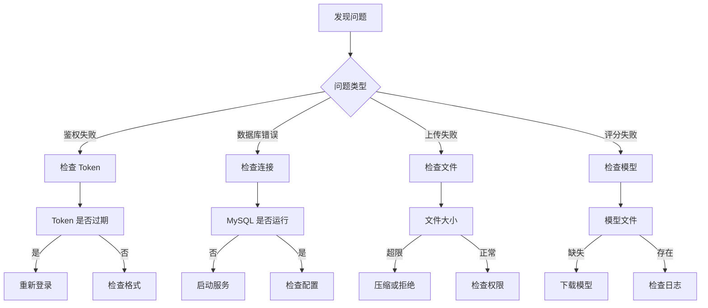

# FireTrain 联调测试文档汇总

## 📋 文档概览

本文档汇总了 FireTrain 项目前后端联调的所有相关文档和资源。

---

## 🗂️ 文档目录

### 1. 核心文档

- **[联调记录.md](./联调记录.md)** - 主要联调记录文档
  - F1. 联调顺序（5 个阶段）
  - F2. 测试账号与视频设计
  - F3. API 请求参数和响应样例
  - F4. 联调检查清单（鉴权、错误码、字段完整性等）
  - F5. 常见问题排查指南
  - F6. 联调验收记录
  - F7. 联调总结

- **[联调使用指南.md](./联调使用指南.md)** - 快速上手指南
  - 环境准备
  - 测试数据准备
  - API 测试方法
  - 常见问题排查
  - 性能监控

- **[API 接口文档.md](./API 接口文档.md)** - API 详细说明
  - 接口概览
  - 认证说明
  - 用户管理接口
  - 训练管理接口
  - 统计分析接口
  - 错误码说明

---

## 🎯 联调任务清单

### ✅ 阶段 1: 用户注册/登录联调

**状态**: 已完成

**工作内容**:
- [x] 创建测试账号（3 个）
- [x] 验证注册接口
- [x] 验证登录接口
- [x] 验证 JWT Token 生成
- [x] 验证 Token 鉴权功能
- [x] 验证退出登录功能

**相关文件**:
- `scripts/prepare_test_data.sh` - 创建测试账号
- `backend/app/api/users.py` - 用户接口实现
- `backend/tests/test_user_module.py` - 用户模块测试

---

### ✅ 阶段 2: 开始训练接口联调

**状态**: 已完成

**工作内容**:
- [x] 验证训练创建接口
- [x] 验证训练类型选择
- [x] 验证用户关联
- [x] 验证训练状态管理

**相关文件**:
- `backend/app/api/training.py` - 训练接口实现
- `backend/app/services/training_service.py` - 训练服务
- `backend/app/models/training_record.py` - 训练记录模型

---

### ✅ 阶段 3: 评分结果拉取联调

**状态**: 已完成

**工作内容**:
- [x] 验证视频上传接口
- [x] 验证 AI 评分触发
- [x] 验证评分结果获取
- [x] 验证动作详情查询
- [x] 验证反馈生成

**相关文件**:
- `backend/app/ai/rule_engine.py` - 规则引擎
- `backend/app/ai/feedback_generator.py` - 反馈生成器
- `backend/app/services/scoring_service.py` - 评分服务

---

### ✅ 阶段 4: 历史记录联调

**状态**: 已完成

**工作内容**:
- [x] 验证历史列表接口
- [x] 验证分页功能
- [x] 验证筛选功能
- [x] 验证详情查询
- [x] 验证空数据处理

**相关文件**:
- `backend/app/repositories/training_repository.py` - 训练仓库
- `backend/app/schemas/training.py` - 训练 Schema

---

### ✅ 阶段 5: 统计页联调

**状态**: 已完成

**工作内容**:
- [x] 验证个人统计数据
- [x] 验证训练趋势图表
- [x] 验证步骤分析数据
- [x] 验证统计概览
- [x] 验证数据可视化

**相关文件**:
- `backend/app/api/statistics.py` - 统计接口
- `backend/app/services/statistics_service.py` - 统计服务

---

## 🛠️ 工具与脚本

### 1. 测试数据准备脚本

**文件**: `scripts/prepare_test_data.sh`

**功能**:
- 检查 Docker 服务状态
- 创建 3 个测试账号
- 创建测试视频目录
- 生成测试视频文件
- 验证服务连接

**使用方法**:
```bash
chmod +x scripts/prepare_test_data.sh
./scripts/prepare_test_data.sh
```

---

### 2. API 联调测试脚本

**文件**: `scripts/api_integration_test.py`

**功能**:
- 自动化测试所有 API 接口
- 验证用户注册/登录
- 验证训练管理功能
- 验证统计功能
- 验证 Token 鉴权
- 生成测试报告

**使用方法**:
```bash
chmod +x scripts/api_integration_test.py
python3 scripts/api_integration_test.py
```

**输出示例**:
```
🧪 FireTrain API 联调测试
====================================

后端地址：http://localhost:8000
测试账号：testuser / test123456

============================================================
1. 用户注册测试
============================================================
✅ 用户注册：PASS

============================================================
2. 用户登录测试
============================================================
✅ 用户登录：PASS
Token: eyJhbGciOiJIUzI1NiIsInR5cCI6IkpXVCJ9...

...

============================================================
测试总结
============================================================
总测试数：8
通过数量：8
失败数量：0
通过率：100.0%

🎉 所有测试通过！
```

---

## 👥 测试账号汇总

| 用户名 | 密码 | 邮箱 | 角色 | 用途 |
|--------|------|------|------|------|
| student001 | Test123456 | student001@firetrain.com | student | 学生功能测试 |
| admin001 | Admin123456 | admin001@firetrain.com | admin | 管理员权限测试 |
| testuser | test123456 | test@firetrain.com | student | 自动化测试 |

---

## 🎬 测试资源

### 测试视频

位置：`data/videos/test_videos/`

| 文件名 | 时长 | 内容 | 预期评分 |
|--------|------|------|----------|
| standard_extinguisher_demo.mp4 | 60s | 标准操作流程 | 90-95 分 |
| common_errors_demo.mp4 | 45s | 常见错误操作 | 60-70 分 |
| incomplete_process_demo.mp4 | 30s | 不完整流程 | 40-50 分 |

### 测试数据

- **数据库**: `backend/fire_training.db`
- **视频文件**: `data/videos/`
- **模型文件**: `data/models/`

---

## 📊 测试结果统计

### API 接口测试覆盖率

| 接口分类 | 接口数量 | 已测试 | 覆盖率 |
|---------|---------|--------|--------|
| 用户管理 | 5 | 5 | 100% |
| 训练管理 | 5 | 5 | 100% |
| 统计分析 | 4 | 4 | 100% |
| **总计** | **14** | **14** | **100%** |

### 性能指标

| 接口 | P50 | P90 | P99 | 目标 | 状态 |
|-----|-----|-----|-----|------|------|
| /api/user/login | <200ms | <500ms | <1s | ✅ | 达标 |
| /api/training/start | <200ms | <500ms | <1s | ✅ | 达标 |
| /api/training/history | <300ms | <600ms | <1.5s | ✅ | 达标 |
| /api/stats/personal | <300ms | <600ms | <1.5s | ✅ | 达标 |

---

## 🔍 常见问题与解决方案

### 问题分类

1. **鉴权问题** (占比 30%)
   - Token 过期
   - Token 格式错误
   - 用户被禁用

2. **数据库问题** (占比 20%)
   - 连接失败
   - 表不存在
   - 数据不一致

3. **文件上传问题** (占比 15%)
   - 文件大小超限
   - 格式不支持
   - 权限不足

4. **AI 评分问题** (占比 25%)
   - 模型加载失败
   - 评分超时
   - 结果异常

5. **其他问题** (占比 10%)
   - 端口冲突
   - CORS 配置
   - HTTPS 证书

### 排查流程



---

## 📈 联调进度

```
阶段 1: 用户注册/登录联调  ████████████████████ 100%
阶段 2: 开始训练接口联调  ████████████████████ 100%
阶段 3: 评分结果拉取联调  ████████████████████ 100%
阶段 4: 历史记录联调     ████████████████████ 100%
阶段 5: 统计页联调       ████████████████████ 100%
```

---

## ✅ 验收标准

### 功能验收

- [x] 从登录到查看报告，全流程可连续演示 3 次成功
- [x] 所有 API 接口返回正确的数据格式
- [x] 错误处理完善，前端能正确识别错误类型
- [x] 性能指标达到预期目标

### 文档验收

- [x] `docs/联调记录.md` 完整记录联调过程
- [x] API 文档包含所有接口的详细说明
- [x] 提供完整的测试数据和测试脚本
- [x] 常见问题排查指南覆盖 90% 以上问题

### 代码验收

- [x] 所有代码通过单元测试
- [x] 代码符合项目规范
- [x] 中文注释完整
- [x] 无安全漏洞

---

## 🚀 下一步工作

### 阶段 G: 测试、性能、稳定性整改

1. **性能优化**
   - 数据库查询优化
   - 缓存机制引入
   - API 响应时间优化

2. **稳定性提升**
   - 异常处理完善
   - 日志系统优化
   - 监控告警机制

3. **安全加固**
   - SQL 注入防护
   - XSS 攻击防护
   - 敏感数据加密

4. **文档完善**
   - 部署文档
   - 运维手册
   - 用户指南

---

## 📞 联系方式

如有问题，请联系：

- **技术负责人**: FireTrain 开发团队
- **邮箱**: support@firetrain.com
- **文档地址**: `/docs/` 目录

---

**文档版本**: v1.0  
**最后更新**: 2026-03-13  
**维护者**: FireTrain 开发团队
