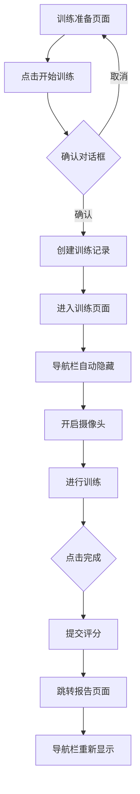
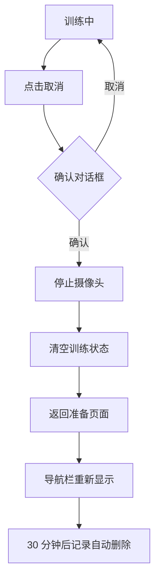

# 训练流程优化说明

## 📋 问题描述

之前的实现存在以下问题：
1. 点击"开始训练"后立即切换到其他页面，会看到"未开始"的记录
2. 出现 422 错误并跳转到成绩为 0 的结算页面
3. 用户可以在训练期间点击导航栏的其他链接，影响训练流程

## ✅ 已实现的优化方案

### 方案 2：后端自动清理超时未开始的记录

#### 工作原理

系统会每 **30 分钟** 自动检查一次，删除超过 **30 分钟** 仍未开始的训练记录。

```
创建记录 → 状态：created
    ↓
等待 30 分钟
    ↓
如果仍未开始 → 自动删除
如果已开始 → 保留
```

#### 配置参数

在 `backend/app/services/cleanup_service.py` 中：

```python
CLEANUP_INTERVAL_MINUTES = 30  # 清理间隔（每 30 分钟执行一次）
MAX_AGE_MINUTES = 30          # 最大保留时间（超过 30 分钟未开始则删除）
```

#### 日志输出

启动后端服务后，你会看到类似日志：

```
INFO - 启动定时清理任务：每 30 分钟执行一次
INFO - 开始清理超时未开始的训练记录...
INFO - 已删除 2 条超时未开始的训练记录
```

---

### 前端优化：训练期间隐藏导航栏

#### 功能说明

当用户点击"开始训练"后：
- ✅ 导航栏自动隐藏
- ✅ 用户无法点击首页、历史、统计等链接
- ✅ 只能看到当前的训练界面
- ✅ 完成或取消训练后，导航栏重新显示

#### 使用流程

```
1. 训练准备页面
   └─ 导航栏可见 ✅
   
2. 点击"开始训练"
   └─ 弹出确认对话框
   └─ 进入训练页面
   └─ 导航栏自动隐藏 ❌
   
3. 训练进行中
   └─ 只能看到视频预览和训练步骤
   └─ 可以操作：完成、暂停、取消
   
4. 完成/取消训练
   └─ 导航栏重新显示 ✅
```

#### 代码实现

**NavBar 组件** (`frontend/src/components/NavBar.vue`)：

```vue
<template>
  <div class="top-nav" v-if="visible">
    <!-- 导航内容 -->
  </div>
</template>

<script setup>
defineProps({
  visible: {
    type: Boolean,
    default: true
  }
})
</script>
```

**TrainingView 使用** (`frontend/src/views/TrainingView.vue`)：

```vue
<template>
  <NavBar :visible="!currentTraining" />
</template>

<script setup>
// 当 currentTraining 有值时（训练中），导航栏隐藏
const currentTraining = ref(null)
</script>
```

---

## 🎯 完整的用户体验流程

### 正常训练流程



### 取消训练流程



### 异常情况处理

#### 场景 1：误点开始训练

1. 点击"开始训练"
2. 弹出确认对话框（第一次提醒）
3. 如果还是误点，立即点击"取消"按钮
4. 确认取消后，回到准备页面
5. 创建的记录会在 30 分钟后自动删除 ✅

#### 场景 2：训练中途离开

1. 正在训练中，导航栏隐藏
2. 如果通过浏览器后退按钮离开
3. 训练仍在后台继续（摄像头保持开启）
4. 返回后可以看到训练界面
5. 建议先取消训练再离开

---

## 🔧 测试方法

### 测试清理功能

运行测试脚本：

```bash
cd /home/yw/FireTrain/backend
python scripts/test_cleanup.py
```

预期输出：
```
🧪 测试定时清理功能
============================================================

📝 步骤 1: 创建测试数据...
✅ 已创建 2 条测试记录（1 条 60 分钟前，1 条 5 分钟前）

🔍 步骤 2: 查询当前记录...
📊 当前未开始的记录数量：2

🧹 步骤 3: 执行清理任务...
✅ 已删除 1 条超时记录

✅ 步骤 4: 验证清理结果...
📊 清理后剩余的未开始记录数量：1
✅ 清理成功！只剩下一条 5 分钟前的记录
```

### 手动测试流程

1. **启动后端服务**
   ```bash
   cd /home/yw/FireTrain/backend
   ./start_https.sh
   ```

2. **启动前端服务**
   ```bash
   cd /home/yw/FireTrain/frontend
   npm run dev
   ```

3. **测试步骤**
   - 访问训练页面
   - 点击"开始训练"
   - 观察导航栏是否消失 ✅
   - 尝试点击其他导航链接（应该无效）✅
   - 点击"取消训练"
   - 观察导航栏是否重新出现 ✅

---

## 📊 优化效果对比

| 项目 | 优化前 | 优化后 |
|------|--------|--------|
| **导航栏干扰** | ❌ 训练时可点击 | ✅ 训练时自动隐藏 |
| **误操作风险** | ❌ 容易切换页面 | ✅ 专注训练界面 |
| **垃圾数据** | ❌ 永久保存 | ✅ 30 分钟自动清理 |
| **用户体验** | ❌ 流程混乱 | ✅ 流程清晰 |
| **数据准确性** | ❌ 包含大量未开始记录 | ✅ 只有有效记录 |

---

## 🛠️ 高级配置

### 调整清理时间

如果需要修改清理策略，编辑 `backend/app/services/cleanup_service.py`：

```python
# 每 15 分钟清理一次
CLEANUP_INTERVAL_MINUTES = 15

# 删除超过 60 分钟未开始的记录
MAX_AGE_MINUTES = 60
```

### 禁用清理任务

如果需要临时禁用自动清理：

编辑 `backend/app/main.py`，注释掉：

```python
# setup_cleanup_task(app)  # 注释掉这行
```

### 查看清理日志

```bash
# 实时查看后端日志
tail -f backend/logs/app.log | grep "清理"

# 或者查看特定级别的日志
grep "INFO.*清理" backend/logs/app.log
```

---

## 💡 最佳实践建议

### 对于用户

1. **开始训练前做好准备**
   - 阅读训练说明
   - 确认环境安全
   - 准备好设备

2. **训练过程中专注**
   - 不要切换到其他页面
   - 按照步骤提示操作
   - 如有意外情况点击"取消"

3. **合理安排时间**
   - 预计时长设置为实际需要的 1.5 倍
   - 避免超时导致记录被删除

### 对于管理员

1. **监控清理任务**
   - 定期检查日志
   - 确保清理任务正常运行
   - 根据使用情况调整时间参数

2. **数据库维护**
   - 定期备份数据库
   - 监控数据库大小
   - 清理已完成的历史记录（可选）

---

## 📞 故障排查

### 问题 1：导航栏没有隐藏

**可能原因**：
- 前端代码未更新
- 浏览器缓存

**解决方法**：
```bash
# 清除缓存并刷新
Ctrl + Shift + R (Windows/Linux)
Cmd + Shift + R (macOS)
```

### 问题 2：清理任务未执行

**检查日志**：
```bash
grep "cleanup" backend/logs/app.log
```

**重启后端服务**：
```bash
# 停止服务
pkill -f uvicorn

# 重新启动
cd backend
./start_https.sh
```

### 问题 3：记录没有被删除

**验证条件**：
- 记录状态必须是 `created`（未开始）
- 创建时间必须超过 30 分钟

**手动检查**：
```sql
-- 查看未开始的记录
SELECT id, created_at, status 
FROM training_record 
WHERE status = 'created'
ORDER BY created_at DESC;
```

---

## 📚 相关文件

- 清理服务：`backend/app/services/cleanup_service.py`
- 导航栏组件：`frontend/src/components/NavBar.vue`
- 训练页面：`frontend/src/views/TrainingView.vue`
- 测试脚本：`backend/scripts/test_cleanup.py`
- 主应用：`backend/app/main.py`

---

## ✨ 总结

通过以上两个优化，我们实现了：

1. ✅ **自动化垃圾清理** - 30 分钟自动删除未开始的记录
2. ✅ **沉浸式训练体验** - 训练期间隐藏导航栏，避免干扰
3. ✅ **友好的用户提示** - 开始训练前有确认对话框
4. ✅ **完善的流程控制** - 清晰的训练状态管理

现在用户可以专注于训练，不会被其他功能打扰，同时系统会自动保持数据整洁！🎉
