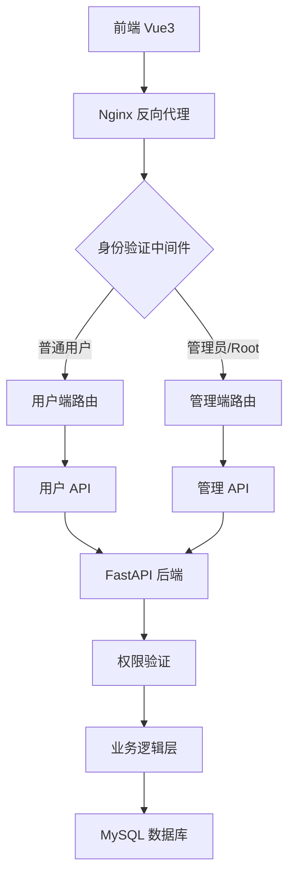

# FireTrain 后台管理系统设计文档

## 📋 文档信息

- **项目名称**: FireTrain 智能消防技能训练评测系统 - 后台管理模块
- **版本**: v1.0
- **创建时间**: 2026-03-19
- **目标**: 构建完整的后台管理系统，支持多角色权限控制

---

## 🎯 一、系统概述

### 1.1 项目背景

当前的 FireTrain 系统仅面向普通用户，缺乏后台管理功能。需要新增后台管理系统，实现：
- 管理员对所有用户和训练数据的全面管理
- 多角色权限控制（普通用户、管理员、Root）
- 视频上传与 AI 检测功能
- 灵活的角色切换机制

### 1.2 核心目标

1. **权限分级**: 实现三级用户体系（普通用户、管理员、Root）
2. **数据管理**: 对所有训练数据进行增删查改
3. **视频检测**: 支持管理员上传视频进行 AI 分析
4. **角色切换**: 管理员可在普通用户和管理员界面间切换
5. **安全管理**: Root 用户专属管理后台，防止越权操作

---

## 👥 二、用户角色设计

### 2.1 角色定义

| 角色 | 标识 | 权限等级 | 说明 |
|------|------|---------|------|
| **普通用户** | `user` | L1 | 基础训练功能，只能查看自己的数据 |
| **管理员** | `admin` | L2 | 管理所有普通用户数据，可切换身份 |
| **Root 用户** | `root` | L3 | 最高权限，管理后台 + 管理员管理 |

### 2.2 权限矩阵

| 功能模块 | 普通用户 | 管理员 | Root 用户 |
|---------|---------|--------|----------|
| **个人训练** | ✅ | ✅ (切换后) | ❌ |
| **个人中心** | ✅ (仅查看) | ✅ (切换后) | ✅ |
| **后台管理** | ❌ | ✅ | ✅ |
| **用户管理** | ❌ | ✅ (普通用户) | ✅ (所有用户) |
| **训练数据管理** | ❌ (仅自己) | ✅ (所有数据) | ✅ (所有数据) |
| **视频上传检测** | ❌ | ✅ | ✅ |
| **管理员管理** | ❌ | ❌ | ✅ |
| **角色切换** | ❌ | ✅ | ✅ |
| **系统统计** | ❌ (仅个人) | ✅ | ✅ |

### 2.3 角色切换逻辑

```python
# 用户表结构增强
class User(Base):
    id: int
    username: str
    email: str
    role: str  # "user" | "admin" | "root"
    is_active: bool
    
    # 新增字段
    can_switch_role: bool = False  # 是否允许角色切换（仅管理员为 True）
    original_role: str = None      # 原始角色（用于切换回管理员）
```

**切换流程**:
```
管理员登录 → 默认进入后台管理界面
          ↓
点击"切换到用户模式" → role="user", original_role="admin"
          ↓
显示用户界面，隐藏管理功能
          ↓
点击"切换回管理员" → role="admin", original_role=None
          ↓
恢复后台管理界面
```

---

## 🏗️ 三、系统架构设计

### 3.1 整体架构



### 3.2 技术栈

**前端**:
- Vue 3 + Vite
- Element Plus (UI 组件库)
- Pinia (状态管理)
- Vue Router (路由管理)
- Axios (HTTP 客户端)

**后端**:
- FastAPI (Python)
- SQLAlchemy (ORM)
- JWT (身份认证)
- MySQL 8.0 (数据库)

---

## 🎨 四、界面设计

### 4.1 用户端界面

#### 4.1.1 首页（用户视角）

```
┌─────────────────────────────────────────────┐
│  🔥 FireTrain                    [头像▼]   │
│                                             │
│  ┌─────────────────────────────────────┐   │
│  │  📋 开始训练                         │   │
│  │                                     │   │
│  │  训练类型：🔥 灭火器操作             │   │
│  │  预计时长：120 秒 [▲▼]              │   │
│  │                                     │   │
│  │         [▶️ 开始训练]                │   │
│  └─────────────────────────────────────┘   │
│                                             │
│  📊 我的统计                                │
│  ┌─────────┬─────────┬─────────┐           │
│  │ 总训练  │ 平均分  │ 最佳成绩│           │
│  │   15    │  85.5   │   92    │           │
│  └─────────┴─────────┴─────────┘           │
└─────────────────────────────────────────────┘
```

#### 4.1.2 个人中心（管理员切换后）

```
┌─────────────────────────────────────────────┐
│  👤 个人中心                      [切换按钮] │
│                                             │
│  基本信息                                   │
│  ┌─────────────────────────────────────┐   │
│  │ 用户名：张三                        │   │
│  │ 邮箱：zhangsan@example.com          │   │
│  │ 角色：普通用户 (管理员已切换)        │   │
│  │                                     │   │
│  │ [编辑资料] [修改密码]               │   │
│  └─────────────────────────────────────┘   │
│                                             │
│  🔄 当前为普通用户模式                      │
│     [切换回管理员身份 →]                    │
└─────────────────────────────────────────────┘
```

### 4.2 管理端界面

#### 4.2.1 后台管理首页

```
┌─────────────────────────────────────────────┐
│  🔥 FireTrain 后台管理           [管理员▼]  │
├─────────────────────────────────────────────┤
│  侧边栏          │  主内容区                 │
│  ┌──────────┐   │  ┌─────────────────────┐ │
│  │ 📊 仪表盘│   │  │ 📊 系统概览         │ │
│  │ 👥 用户  │   │  │                     │ │
│  │ 📋 训练  │   │  │ 总用户数：1,234     │ │
│  │ 📹 视频  │   │  │ 今日训练：567       │ │
│  │ ⚙️ 设置  │   │  │ 平均分数：82.5      │ │
│  └──────────┘   │  └─────────────────────┘ │
│                  │                          │
│  [← 返回用户模式]│  [快速操作]              │
│                  │  [+ 上传视频检测]        │
└─────────────────────────────────────────────┘
```

#### 4.2.2 用户管理页面

```
┌─────────────────────────────────────────────┐
│  👥 用户管理                                │
├─────────────────────────────────────────────┤
│  搜索：[________] 角色：[全部▼] 状态：[正常▼]│
│                                             │
│  ┌───────────────────────────────────────┐ │
│  │ ID │ 用户名 │ 角色 │ 训练次数 │ 操作  │ │
│  ├────┼────────┼──────┼──────────┼───────┤ │
│  │ 1  │ 张三   │ user │   15     │查看│删│ │
│  │ 2  │ 李四   │ user │   23     │查看│删│ │
│  │ 3  │ 王五   │admin │   89     │查看│删│ │
│  └───────────────────────────────────────┘ │
│                                             │
│  共 1234 条记录  [< 1 2 3 ... 50 >]         │
└─────────────────────────────────────────────┘
```

#### 4.2.3 训练数据管理页面

```
┌─────────────────────────────────────────────┐
│  📋 训练数据管理                            │
├─────────────────────────────────────────────┤
│  用户：[全部▼] 类型：[全部▼] 状态：[全部▼]  │
│  时间：[2026-01-01] 至 [2026-03-19]        │
│                                             │
│  ┌───────────────────────────────────────┐ │
│  │ ID │ 用户 │ 类型 │ 分数 │ 状态 │ 操作 │ │
│  ├────┼──────┼──────┼──────┼──────┼──────┤ │
│  │101 │ 张三 │灭火  │ 85.5 │已完成│查│删│ │
│  │102 │ 李四 │灭火  │ 92.0 │已完成│查│删│ │
│  │103 │ 王五 │其他  │ 78.3 │进行中│查│删│ │
│  └───────────────────────────────────────┘ │
└─────────────────────────────────────────────┘
```

#### 4.2.4 视频上传检测页面

```
┌─────────────────────────────────────────────┐
│  📹 视频上传检测                            │
├─────────────────────────────────────────────┤
│  ┌─────────────────────────────────────┐   │
│  │  📤 拖拽视频文件到此处或点击上传     │   │
│  │                                     │   │
│  │  支持格式：MP4, AVI, MOV            │   │
│  │  最大文件大小：500MB                │   │
│  └─────────────────────────────────────┘   │
│                                             │
│  待检测视频列表                             │
│  ┌───────────────────────────────────────┐ │
│  │ 文件名 │ 大小 │ 上传时间 │ 状态 │ 操作│ │
│  ├────────┼──────┼──────────┼──────┼─────┤ │
│  │test.mp4│25MB  │ 10:30   │等待中│检测│ │
│  └───────────────────────────────────────┘ │
└─────────────────────────────────────────────┘
```

#### 4.2.5 管理员管理页面（仅 Root）

```
┌─────────────────────────────────────────────┐
│  👮 管理员管理 (仅 Root 用户可见)            │
├─────────────────────────────────────────────┤
│  [+ 新增管理员]                             │
│                                             │
│  ┌───────────────────────────────────────┐ │
│  │ ID │ 用户名 │ 邮箱 │ 创建时间 │ 操作  │ │
│  ├────┼────────┼──────┼──────────┼───────┤ │
│  │ 1  │ admin1 │a@x.c │2026-01-01│删除│  │ │
│  │ 2  │ admin2 │b@x.c │2026-02-15│删除│  │ │
│  └───────────────────────────────────────┘ │
│                                             │
│  ⚠️ 注意：删除管理员将永久失去管理权限      │
└─────────────────────────────────────────────┘
```

---

## 🗄️ 五、数据库设计

### 5.1 用户表增强

```sql
-- 原用户表
ALTER TABLE users ADD COLUMN 
    can_switch_role BOOLEAN DEFAULT FALSE COMMENT '是否允许角色切换',
    original_role VARCHAR(20) NULL COMMENT '原始角色（切换时使用）';

-- 更新现有管理员
UPDATE users SET can_switch_role = TRUE WHERE role = 'admin';
```

### 5.2 新增表结构

#### 5.2.1 管理员日志表

```sql
CREATE TABLE admin_logs (
    id INT PRIMARY KEY AUTO_INCREMENT,
    admin_id INT NOT NULL COMMENT '管理员 ID',
    action VARCHAR(50) NOT NULL COMMENT '操作类型',
    target_type VARCHAR(50) COMMENT '目标类型',
    target_id INT COMMENT '目标 ID',
    details JSON COMMENT '操作详情',
    ip_address VARCHAR(45) COMMENT 'IP 地址',
    created_at DATETIME DEFAULT CURRENT_TIMESTAMP,
    
    FOREIGN KEY (admin_id) REFERENCES users(id),
    INDEX idx_admin_id (admin_id),
    INDEX idx_action (action),
    INDEX idx_created_at (created_at)
);
```

#### 5.2.2 视频检测任务表

```sql
CREATE TABLE video_detection_tasks (
    id INT PRIMARY KEY AUTO_INCREMENT,
    uploader_id INT NOT NULL COMMENT '上传者 ID',
    file_name VARCHAR(255) NOT NULL COMMENT '文件名',
    file_path VARCHAR(500) NOT NULL COMMENT '文件路径',
    file_size BIGINT COMMENT '文件大小（字节）',
    status ENUM('pending', 'processing', 'completed', 'failed') DEFAULT 'pending',
    ai_result JSON COMMENT 'AI 分析结果',
    error_message TEXT COMMENT '错误信息',
    created_at DATETIME DEFAULT CURRENT_TIMESTAMP,
    completed_at DATETIME NULL,
    
    FOREIGN KEY (uploader_id) REFERENCES users(id),
    INDEX idx_uploader (uploader_id),
    INDEX idx_status (status)
);
```

---

## 🔐 六、权限系统设计

### 6.1 权限中间件

```python
# backend/app/middleware/permission.py
from functools import wraps
from fastapi import HTTPException, status

def require_role(*allowed_roles: str):
    """
    权限装饰器
    用法：@require_role("admin", "root")
    """
    def decorator(func):
        @wraps(func)
        async def wrapper(*args, current_user: dict, **kwargs):
            user_role = current_user.get("role")
            
            if user_role not in allowed_roles:
                raise HTTPException(
                    status_code=status.HTTP_403_FORBIDDEN,
                    detail="权限不足"
                )
            
            return await func(*args, current_user=current_user, **kwargs)
        return wrapper
    return decorator
```

### 6.2 API 路由权限

```python
# backend/app/api/admin.py
from app.middleware.permission import require_role

router = APIRouter(prefix="/api/admin", tags=["后台管理"])

@router.get("/users")
@require_role("admin", "root")
async def get_all_users(...):
    """获取所有用户（管理员和 Root）"""
    pass

@router.delete("/users/{user_id}")
@require_role("admin", "root")
async def delete_user(user_id: int, current_user: dict):
    """删除用户（管理员和 Root）"""
    pass

@router.post("/admins")
@require_role("root")  # 仅 Root 用户
async def create_admin(...):
    """创建管理员（仅 Root）"""
    pass
```

---

## 🔄 七、角色切换流程

### 7.1 前端切换逻辑

```javascript
// frontend/src/views/ProfileView.vue (管理员版本)
const switchToUserMode = async () => {
  // 保存原始角色
  localStorage.setItem('original_role', userStore.role)
  
  // 临时切换为用户角色
  userStore.setRole('user')
  
  // 跳转到用户首页
  router.push('/')
  
  ElMessage.success('已切换为普通用户模式')
}

const switchBackToAdmin = () => {
  // 恢复管理员角色
  const originalRole = localStorage.getItem('original_role')
  userStore.setRole(originalRole || 'admin')
  localStorage.removeItem('original_role')
  
  // 跳转到管理后台
  router.push('/admin')
  
  ElMessage.success('已切换回管理员模式')
}
```

### 7.2 后端验证逻辑

```python
# backend/app/services/user_service.py
async def switch_role(self, user_id: int, target_role: str) -> dict:
    """
    切换用户角色（临时）
    
    Args:
        user_id: 用户 ID
        target_role: 目标角色
        
    Returns:
        新的用户信息
    """
    user = await self.user_repo.get_by_id(user_id)
    
    # 验证是否允许切换
    if not user.can_switch_role:
        raise ValueError("该用户不允许切换角色")
    
    # 仅允许在 user 和 admin 之间切换
    if target_role not in ["user", "admin"]:
        raise ValueError("不支持的角色切换")
    
    # 保存原始角色
    if target_role == "user":
        user.original_role = user.role
        user.role = "user"
    else:
        # 恢复原始角色
        user.role = user.original_role or "admin"
        user.original_role = None
    
    await self.user_repo.update(user)
    
    return {"role": user.role, "original_role": user.original_role}
```

---

## 📊 八、统计与监控

### 8.1 系统统计指标

```python
class SystemStatistics:
    """系统统计数据"""
    
    # 用户统计
    total_users: int          # 总用户数
    active_users: int         # 活跃用户数
    new_users_today: int      # 今日新增用户
    
    # 训练统计
    total_trainings: int      # 总训练次数
    trainings_today: int      # 今日训练次数
    average_score: float      # 平均分数
    
    # 视频检测
    pending_videos: int       # 待检测视频数
    completed_videos: int     # 已完成检测数
    
    # 管理员操作
    admin_actions_today: int  # 今日管理员操作次数
```

### 8.2 管理员操作日志

```python
# 记录所有管理员操作
async def log_admin_action(
    admin_id: int,
    action: str,
    target_type: str = None,
    target_id: int = None,
    details: dict = None,
    ip_address: str = None
):
    """记录管理员操作日志"""
    
    log_entry = AdminLog(
        admin_id=admin_id,
        action=action,
        target_type=target_type,
        target_id=target_id,
        details=details,
        ip_address=ip_address
    )
    
    await db.add(log_entry)
    await db.commit()
```

---

## 🎯 九、关键功能实现要点

### 9.1 数据隔离

```python
# 普通用户：只能查看自己的数据
@router.get("/my-trainings")
async def get_my_trainings(current_user: dict):
    user_id = current_user["id"]
    trainings = await training_repo.query(user_id=user_id)
    return trainings

# 管理员：可以查看所有用户数据
@router.get("/all-trainings")
@require_role("admin", "root")
async def get_all_trainings(current_user: dict):
    trainings = await training_repo.query_all()
    return trainings
```

### 9.2 视频检测流程

```python
# 1. 上传视频
@router.post("/upload-video")
@require_role("admin", "root")
async def upload_video(file: UploadFile, current_user: dict):
    # 保存文件
    file_path = f"data/videos/{file.filename}"
    with open(file_path, "wb") as f:
        content = await file.read()
        f.write(content)
    
    # 创建检测任务
    task = VideoDetectionTask(
        uploader_id=current_user["id"],
        file_name=file.filename,
        file_path=file_path,
        status="pending"
    )
    await db.add(task)
    await db.commit()
    
    # 异步执行 AI 检测
    asyncio.create_task(run_ai_detection(task.id))
    
    return {"task_id": task.id}

# 2. AI 检测
async def run_ai_detection(task_id: int):
    task = await db.get(VideoDetectionTask, task_id)
    task.status = "processing"
    await db.commit()
    
    try:
        # 调用 AI 推理服务
        service = TrainingInferenceService()
        result = service.analyze_video(task.file_path, "fire_extinguisher")
        
        task.ai_result = result
        task.status = "completed"
    except Exception as e:
        task.error_message = str(e)
        task.status = "failed"
    
    await db.commit()
```

---

## 🔒 十、安全考虑

### 10.1 防护措施

1. **JWT Token 验证**: 所有 API 请求必须携带有效 Token
2. **角色权限验证**: 每个管理 API 都需验证角色权限
3. **操作日志记录**: 所有管理员操作都会被记录
4. **数据校验**: 严格验证所有输入参数
5. **SQL 注入防护**: 使用 SQLAlchemy ORM
6. **XSS 防护**: 前端转义所有用户输入

### 10.2 Root 用户保护

```python
# Root 用户特殊保护
ROOT_USER_ID = 1  # 假设 Root 用户 ID 为 1

@router.delete("/users/{user_id}")
@require_role("root")
async def delete_user(user_id: int):
    # 禁止删除 Root 用户
    if user_id == ROOT_USER_ID:
        raise HTTPException(
            status_code=status.HTTP_403_FORBIDDEN,
            detail="禁止删除 Root 用户"
        )
    
    await user_service.delete_user(user_id)
```

---

## 📈 十一、性能优化

### 11.1 数据库优化

```sql
-- 添加索引
CREATE INDEX idx_training_user_id ON training_records(user_id);
CREATE INDEX idx_training_status ON training_records(status);
CREATE INDEX idx_training_created_at ON training_records(created_at);

-- 分页查询
SELECT * FROM training_records 
WHERE user_id = ? 
ORDER BY created_at DESC 
LIMIT 20 OFFSET 0;
```

### 11.2 缓存策略

```python
from functools import lru_cache

@lru_cache(maxsize=100)
def get_user_statistics(user_id: int):
    """缓存用户统计数据"""
    return statistics_service.get_user_stats(user_id)
```

---

## 🎉 十二、总结

### 12.1 核心特性

✅ **三级权限体系**: 普通用户、管理员、Root 用户  
✅ **角色切换机制**: 管理员可临时切换为普通用户  
✅ **全面数据管理**: 增删查改所有用户和训练数据  
✅ **视频检测功能**: 上传视频进行 AI 分析  
✅ **操作日志审计**: 记录所有管理员操作  
✅ **安全权限控制**: 严格的权限验证和隔离  

### 12.2 技术亮点

- 灵活的 RBAC 权限模型
- 无缝的角色切换体验
- 完整的操作审计日志
- 高性能的数据库设计
- 安全的 API 接口

---

下一步将输出详细的实现文档，包含具体的代码实现步骤！
